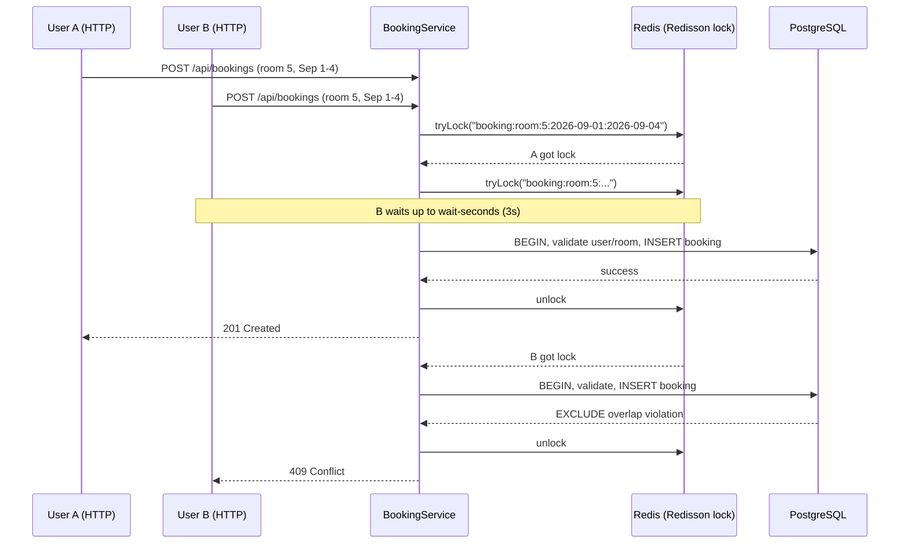

# Redis in the Hotel Booking System

Redis runs alongside PostgreSQL in this project for two purposes:

1. **Caching** — speed up read-heavy hotel APIs (`GET /api/hotels`, `GET /api/hotels/{id}`)
2. **Distributed locking** — serialize concurrent booking attempts for the same room + dates (`POST /api/bookings`)

PostgreSQL remains the **source of truth**. Redis is a performance and coordination layer.

---

## Infrastructure

Redis is started via Docker Compose (same stack as Postgres):

```bash
docker compose up -d          # starts db + redis
docker compose ps             # hms_redis should be healthy
```

| Setting | Value | Purpose |
|---|---|---|
| Container | `hms_redis` | Stable name for `docker exec` |
| Image | `redis:7-alpine` | Pinned version |
| Host port | `6379` (via `REDIS_PORT` in `.env`) | App connects here |
| `maxmemory` | `256mb` | Prevents Redis from OOM-ing the machine |
| `maxmemory-policy` | `allkeys-lru` | Evict least-recently-used keys when full |
| Persistence volume | **none** | Cache + locks are disposable; Postgres is truth |

Hotel cache lives in **hotel-service**. The booking lock lives in **booking-service**.
The `:8080` strangler does not connect to Redis.

Spring Boot (in those services) connects via `application.yml`:

```yaml
spring:
  data:
    redis:
      host: ${REDIS_HOST:localhost}
      port: ${REDIS_PORT:6379}
  cache:
    type: redis
```

---

## Part 1 — Caching

### What is cached

| Endpoint | Cache name | Redis key example | TTL |
|---|---|---|---|
| `GET /api/hotels/{id}` | `hotelById` | `hotelById::1` | 10 min (default) |
| `GET /api/hotels` | `hotelList` | `hotelList::all` | 10 min (default) |

**Not cached:** `POST /api/bookings`, room availability searches (too dynamic).

### Pattern: Cache-Aside

1. Check Redis for the key
2. **Hit** → return cached JSON (no DB query)
3. **Miss** → query Postgres → store in Redis with TTL → return

### Key classes

| Class | Where | Role |
|---|---|---|
| `RedisCacheConfig` | hotel-service | `@EnableCaching`, JSON serialization, TTL, no-null caching |
| `HotelService` | hotel-service | `@Cacheable` on read methods |
| Redis lock | booking-service | Serializes concurrent `POST /api/bookings` for the same room + dates |

### Inspect cache keys

```bash
# List all keys (fine for local dev; use SCAN in production)
docker exec hms_redis redis-cli KEYS '*'

# Check a specific hotel
docker exec hms_redis redis-cli EXISTS "hotelById::1"
docker exec hms_redis redis-cli GET "hotelById::1"
docker exec hms_redis redis-cli TTL "hotelById::1"    # seconds until expiry

# Watch every Redis command live (Ctrl+C to stop)
docker exec -it hms_redis redis-cli MONITOR
```

**Workflow to see a cache hit:**

1. Terminal 1: `docker exec -it hms_redis redis-cli MONITOR`
2. Terminal 2: `curl http://localhost:8080/api/hotels/1` (twice)
3. First call: `GET hotelById::1` (miss) then `SET hotelById::1 ...`
4. Second call: `GET hotelById::1` (hit) — no `SET`, no Postgres SQL in app logs

### Cache invalidation

- **TTL (10 min)** — passive expiry; staleness self-heals
- **`@CacheEvict`** — planned when a hotel update endpoint is added (active invalidation on write)

---

## Part 2 — Distributed locking (Redisson)

### Problem

Two users booking **Room 101** for the **same dates** at the same instant can both pass a "room is free" check before either inserts — a race condition. Without protection, both bookings could succeed (double booking).

### Defense in depth (two layers)

| Layer | Mechanism | Role |
|---|---|---|
| **1. Redis lock** | Redisson `RLock` | Serialize attempts; fail fast (409) without hammering DB |
| **2. DB `EXCLUDE` constraint** | `no_overlap_booking` on `bookings` | Final guarantee even if Redis restarts or lock is bypassed |

If Redis dies and loses all locks, **Layer 2 still prevents double booking**.

### Lock key design

Keys must be **specific** — not just `booking:room:5`, but:

```text
booking:room:{roomId}:{checkIn}:{checkOut}
```

Example: `booking:room:5:2026-09-01:2026-09-04`

This scopes the lock to one room **and** one date range. Different date ranges on the same room get different keys and do not block each other.

### Lock timing (`application.yml`)

```yaml
booking:
  lock:
    wait-seconds: 3     # how long User B waits for User A to finish
    lease-seconds: 30   # auto-release if the app crashes mid-booking
```

| Parameter | Meaning | User B scenario |
|---|---|---|
| `wait-seconds: 3` | Max time to **wait for the lock** | If User A finishes within 3s, B gets the lock and proceeds |
| `lease-seconds: 30` | Max time lock **survives without unlock** | If User A's app crashes, lock auto-expires after 30s so B isn't blocked forever |

**Important:** `wait-seconds` is NOT "retry for 30 seconds." User B waits **up to 3 seconds**. If the lock is still held after 3s, B gets **409 Conflict** immediately. The 30s is only the crash-safety TTL on the lock itself.

### Critical ordering: lock BEFORE transaction

```text
✅ CORRECT:  acquire Redis lock → open DB transaction → insert → commit → unlock
❌ WRONG:    open DB transaction → acquire Redis lock  (two txs can start before either locks)
```

`BookingService` uses `TransactionTemplate` so the transaction opens only **after** the lock is held.

### Sequence diagram — concurrent booking



### Key classes

| Class | Role |
|---|---|
| `RedissonConfig` | Creates `RedissonClient` bean (connects to Redis) |
| `BookingLockService` | `tryLock` / `unlock` wrapper around booking critical section |
| `BookingService` | Lock → transaction → insert (defense in depth) |

### Inspect lock keys

```bash
# List active booking locks
docker exec hms_redis redis-cli KEYS 'booking:room:*'

# Watch lock acquire/release live
docker exec -it hms_redis redis-cli MONITOR
```

**Workflow to see a lock in action:**

1. Terminal 1: `docker exec -it hms_redis redis-cli MONITOR`
2. Terminal 2: fire two concurrent bookings for the same room + dates (Postman or curl)
3. You should see Redisson Lua scripts for lock acquire on one request, and the second either waiting or getting 409

Example concurrent test:

```bash
BODY_A='{"userId":1,"roomId":5,"checkInDate":"2026-10-01","checkOutDate":"2026-10-04"}'
BODY_B='{"userId":2,"roomId":5,"checkInDate":"2026-10-01","checkOutDate":"2026-10-04"}'

curl -s -o /dev/null -w "A: %{http_code}\n" -X POST http://localhost:8080/api/bookings \
  -H 'Content-Type: application/json' -d "$BODY_A" &
curl -s -o /dev/null -w "B: %{http_code}\n" -X POST http://localhost:8080/api/bookings \
  -H 'Content-Type: application/json' -d "$BODY_B" &
wait
# Expected: one 201, one 409
```

### Redis CLI cheat sheet

```bash
# Open interactive shell
docker exec -it hms_redis redis-cli

# Inside redis-cli:
PING                          # should return PONG
KEYS *                        # all keys (dev only)
KEYS hotelById::*             # cached hotels
KEYS booking:room:*           # active booking locks
GET hotelById::1              # cached hotel JSON
TTL hotelById::1              # seconds until expiry (-2 = key gone)
EXISTS booking:room:5:2026-10-01:2026-10-04
MONITOR                       # live stream of all commands (Ctrl+C to stop)
DBSIZE                        # total key count
DEL hotelById::1              # manually evict one cache entry (dev debugging)
```

---

## Redis topology concepts (for interviews)

| Mode | What it does | Our project |
|---|---|---|
| **Single server** | One Redis instance | ✅ what we use locally |
| **Persistence (RDB/AOF)** | Survive restarts | Not needed for cache/locks |
| **Sentinel** | Auto-failover if master dies | Overkill for local dev |
| **Cluster** | Shard data across many nodes | Overkill for local dev |

---

## Related docs

- API contracts: `docs/api/hotels.md`, `docs/api/bookings.md`
- DB overlap constraint: `docs/database-schema-postgres.md` (`no_overlap_booking`)
- Performance/indexing: `docs/database-performance.md`
